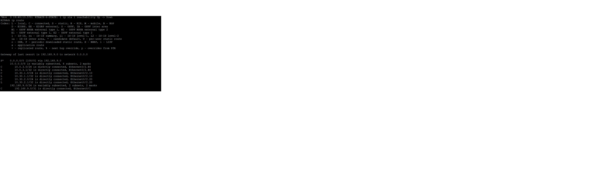

### _Описание решения лабораторной работы_

#### 1. На маршрутизаторе R27 настроен шлюз по умолчанию
     ip route 0.0.0.0 0.0.0.0 192.168.8.0
     
#### Со стороны маршрутизатора R25 настроен маршрут к маршрутизатору R27 к loopback0
     ip route 10.55.1.1 255.255.255.255 192.168.8.1

 #### 2. На маршрутизаторе R28 настроено распределение трафика между 2 ISP
      ip route 0.0.0.0 0.0.0.0 192.168.10.0 50 track 1
      ip route 0.0.0.0 0.0.0.0 192.168.9.0 100
 ####  Выполнена настройка отслеживание линка через технологию IP SLA (отслеживается по доступности loopback0 R26)
      track 1 ip sla 1 reachability
      delay down 90 up 90

      ip sla 1
      icmp-echo 10.44.4.1 source-interface Ethernet0/0
      frequency 30
      ip sla schedule 1 life forever start-time now
       
 ####  Ниже приведены таблицы маршрутизации при  доступности ip address 10.44.4.1 
 
 
 ####  так и при выключении интерфейса e0/1 на мартшрутизаторе R26 (эмуляция недоступности одного из каналов ISP)
 

 Файлы конфигурации маршрутизаторов :  
  [r25](https://github.com/kononenko-yury/otus-network-practics/blob/main/lab12/r25);
  [r26](https://github.com/kononenko-yury/otus-network-practics/blob/main/lab12/r26);
  [r27](https://github.com/kononenko-yury/otus-network-practics/blob/main/lab12/r27);
  [r28](https://github.com/kononenko-yury/otus-network-practics/blob/main/lab12/r28);
