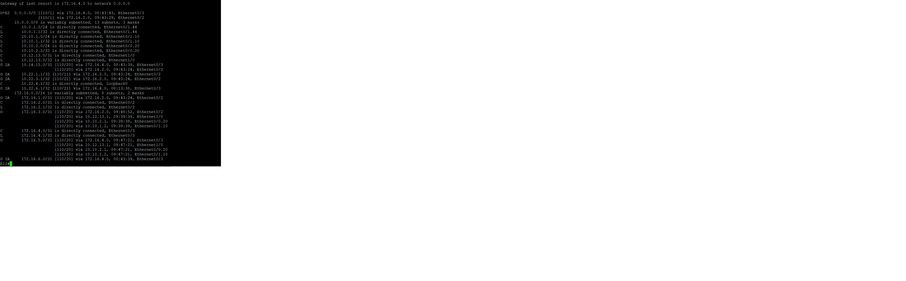

### _Описание решения лабораторной работы_ 15

#### 1. Организация сети в офисе Москва соответствует трехуровневой модели организации сети (от компании Cisco).
##### На уровне распределения были добавлены линки между маршрутизаторами R12 и R13 с целью повышения
##### надежности и снижения нагрузки на уровне ядра и уровне доступа. Это также позволит обьединить данные 
##### маршрутизаторы в area 10.
##### На уровне адра были добавлены линки между маршрутизаторами R14 и R15 с целью повышения надежности и снижения
#####  нагрузки на уровне распределения. Это также позволит обьединить данные маршрутизаторы в area 0.
     
#### 2. Были выполнены настройки ipv4 ospf согласно заданиям лаб.работы
##### Area 101 получает только маршрут по умолчанию путем определения ее как area 101 stub no-summary

##### Area 10 получает все маршруты включая маршрут по умолчанию

    
##### Area 102 получает все маршруты включая маршрут по умолчанию кроме маршрутов area 101 путем выполнения входящей фильтрации

    ip access-list standard NO_AREA_101
    deny   10.22.3.1
    deny   172.16.1.0 0.0.0.1
    permit any

#### 2. Были выполнены настройки ipv6 ospf согласно заданиям лаб.работы (на маршрутизаторах R19,R14,R15,R12,R20)

#####  Area 102 получает все ipv6 маршруты включая маршрут по умолчанию кроме маршрутов area 101 путем выполнения входящей фильтрации

    ipv6 prefix-list NO_AREA_101_V6 seq 5 deny 20FF:CCFF:FFFF:A1::/64
    ipv6 prefix-list NO_AREA_101_V6 seq 10 permit ::/0 le 128

    

Файлы конфигурации маршрутизаторов :  
  [r12](https://github.com/kononenko-yury/otus-network-practics/blob/main/lab12/r12);
  [r13](https://github.com/kononenko-yury/otus-network-practics/blob/main/lab12/r13);
  [r14](https://github.com/kononenko-yury/otus-network-practics/blob/main/lab12/r14);
  [r15](https://github.com/kononenko-yury/otus-network-practics/blob/main/lab12/r15);
  [r19](https://github.com/kononenko-yury/otus-network-practics/blob/main/lab12/r19);
  [r20](https://github.com/kononenko-yury/otus-network-practics/blob/main/lab12/r20);

