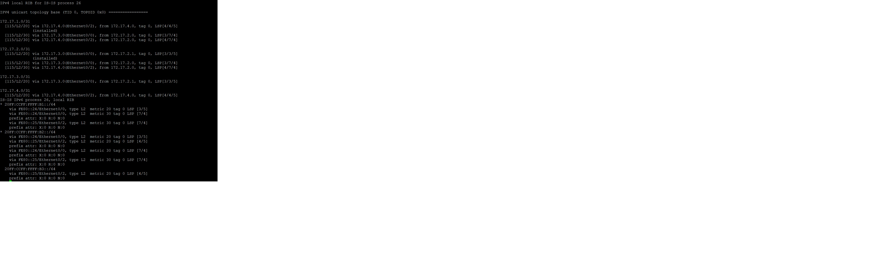

### _Описание решения лабораторной работы_ 19

#### 1. В офисе Триада выполнена настрока протокола isis
##### Вывод команды show isis * rib на маршрутизаторе R26

Файлы конфигурации маршрутизаторов :  
  [r23](https://github.com/kononenko-yury/otus-network-practics/blob/main/lab19/r23);
  [r24](https://github.com/kononenko-yury/otus-network-practics/blob/main/lab19/r24);
  [r25](https://github.com/kononenko-yury/otus-network-practics/blob/main/lab19/r25);
  [r26](https://github.com/kononenko-yury/otus-network-practics/blob/main/lab19/r26);
