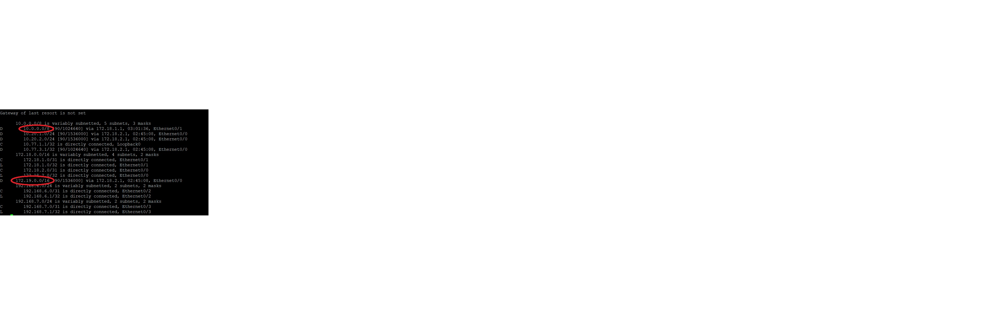

### _Описание решения лабораторной работы_ 21

#### 1. В офисе Санкт-Петербург выполнена настрока протокола eigrp Named-mode (для ipv4 и ipv6)
##### При помощи prefix-list выполнено на маршрутизаторе R16
##### только передача на маршрутизатор R32 default route 
      ip prefix-list FILTER seq 5 permit 0.0.0.0/0
      ip prefix-list FILTER seq 10 deny 0.0.0.0/0 le 32
      
##### только передача на маршрутизатор R18 маршрутов кроме default route       
      ip prefix-list DENY-DEFAULT seq 5 deny 0.0.0.0/0
      ip prefix-list DENY-DEFAULT seq 10 permit 0.0.0.0/0 le 32
      
##### Выполнена передача суммаризированных маршрутов на маршрутизатор R18 от маршрутизаторов R16 и R17
     

Файлы конфигурации маршрутизаторов :  
  [r16](https://github.com/kononenko-yury/otus-network-practics/blob/main/lab19/r16);
  [r17](https://github.com/kononenko-yury/otus-network-practics/blob/main/lab19/r17);
  [r18](https://github.com/kononenko-yury/otus-network-practics/blob/main/lab19/r18);
  [r32](https://github.com/kononenko-yury/otus-network-practics/blob/main/lab19/r32);
  
