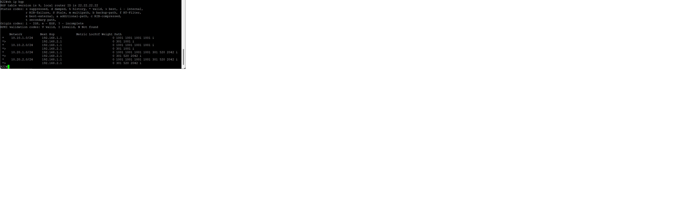
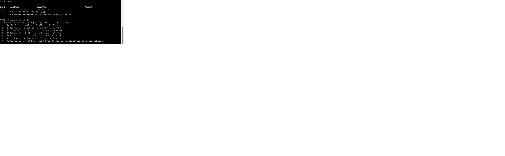

## _Описание решения лабораторной работы_ 27

#### 1. Выполнена настройка iBGP на маршрутизаторах R14 и R15
Для того чтобы входящий трафик шел через провайдера Лимас на R14 увеличен as-path

Для того чтобы исходящий трафик шел через провайдера Лимас на R15 увеличен weight

#### 2. Выполнена настройка iBGP на провайдере Триада, с использованием RR. Route-Reflector назначен R25

#### 3. Выполнена настройка iBGP на маршрутизаторе R18 так, чтобы трафик распределялся по двум линкам одновременно

Проверка общей связанности

Файлы конфигурации маршрутизаторов :  
  [r14](https://github.com/kononenko-yury/otus-network-practics/blob/main/lab27/r14);
  [r15](https://github.com/kononenko-yury/otus-network-practics/blob/main/lab27/r15);
  [r23](https://github.com/kononenko-yury/otus-network-practics/blob/main/lab27/r23);
  [r24](https://github.com/kononenko-yury/otus-network-practics/blob/main/lab27/r24);
  [r25](https://github.com/kononenko-yury/otus-network-practics/blob/main/lab27/r22);
  [r26](https://github.com/kononenko-yury/otus-network-practics/blob/main/lab27/r26);  
  [r18](https://github.com/kononenko-yury/otus-network-practics/blob/main/lab27/r18);
  
