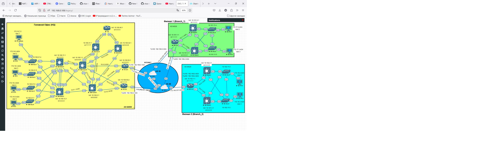
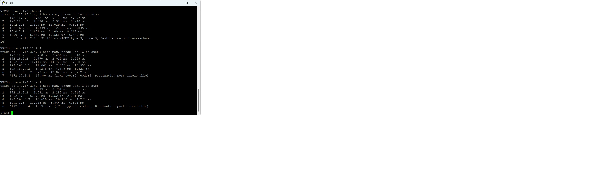
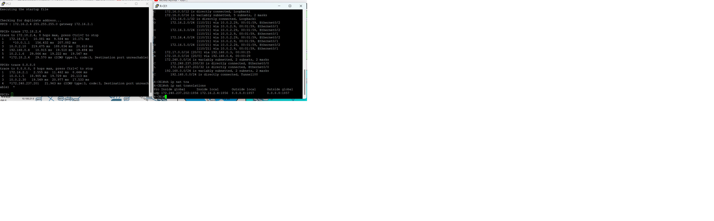

#          Лабораторная работа _"Построение распределенной сети предприятия"_

  В ходе работы была спроектирована сеть предприятия состоящая из Головного Офиса (далее HQ) и 2-х филиалов (далее Branch_1 и Branch_2).

     
#### Для сети HQ был использован следующий принцип:
  1. сеть 10.0.0.0/16 использовались для коммутации сетевого оборудования между собой
  2. сеть 10.100.0.0/16 в дальнейшем предполагается использовать как сеть управления
  3. сеть 172.16.0.0/16 для клиентских рабочих станций

#### Для сети Branch_1 был использован следующий принцип:
  1. сеть 10.1.0.0/16 использовались для коммутации сетевого оборудования между собой
  2. сеть 10.101.0.0/16 в дальнейшем предполагается использовать как сеть управления
  3. сеть 172.17.0.0/16 для клиентских рабочих станций

#### Для сети Branch_2 был использован следующий принцип:
  1. сеть 10.2.0.0/16 использовались для коммутации сетевого оборудования между собой
  2. сеть 10.102.0.0/16 в дальнейшем предполагается использовать как сеть управления
  3. сеть 172.18.0.0/16 для клиентских рабочих станций.
      
  При проектировании сети HQ была использована 3-х уровневая иерархическая модель CISCO с использованием следующего сетевого оборудования:
- на Access Layer - L2 коммутаторы;
- на Distribution Layer - L3 коммутаторы;
- на Core Layer - высокопроизводительные L3 коммутаторы.

При проектировании сети филиалов была использована 2-х уровневая иерархическая модель CISCO с использованием следующего оборудования:
- на Access Layer - L2 коммутаторы;
- на Distribution Layer - L3 коммутаторы.

Для организации подключения HQ к филиалам и выхода в интернет установлены 2 граничащих маршрутизатора (R-CE1 и R-CE2), которые имеют подключение к 2
независимым интернет-сервис провайдерам (ISP1 и ISP2). HQ подключается к ISP по протоколу eBGP. Для маршрутизации внутренних сетей используется OSPF 
протокол, где в качестве DR и BDR выбраны маршрутизаторы SW-Core1 и SW-Core. 

Филиалы подключаются к HQ через  ISP с использованием статической маршрутизации и адресов, предоставленных ISP. 
	 
Соединение HQ с филиалами организовано по технологии DMVPN (3 фаза). Маршрутизация между разнесенными офисами выполняется при помощи протокола eBGP.
Для защиты трафика DMVPN используется протокол ikev2 с сертификатами для аутентификации.

    crypto pki certificate map CERT-MAP 1
    subject-name co ou = dmvpn
    issuer-name co o = otus

    crypto ikev2 profile IKEV2-PROFILE
    match certificate CERT-MAP
    identity local dn
    authentication remote rsa-sig
    authentication local rsa-sig
    pki trustpoint TP-PKI
    dpd 10 5 periodic

В данной работе между HQ и филиалами была использована архитектура сети Dual Hub Dual Cloud (DHDC), часто применяемая при использовании технологии DMVPN. 
В этой конфигурации используются два центральных узла (hub) и две облака (в этом случае spoke), что обеспечивает высокую устойчивость и отказоустойчивость
сети.

Основные преимущества DHDC:
 - отсутствие единой точки отказа: Если один из центральных узлов выходит из строя, другой узел продолжает обрабатывать трафик.
 - быстрая аварийная замена переключение на резервный узел происходит быстро.

При реализации Dual Hub Dual Cloud были выпонены следующие настройки

В HQ на роутере SW-Core1 создан tunnel 100, на роутере SW-Core2 tunnel 200. Tunnel 200 был установлен как резервный. Поэтому роутер SW-Core2 во внутренную
сеть он анонсирует дефолтный маршрут с более высокой метрикой

    default-information originate always metric 20

И филиалам SW-Core2 также анонсирует себя с большей метрикой 

    route-map SET-MED permit 10
      set metric 120
    neighbor 192.168.2.4 route-map SET-MED out

На каждом роутере филиала создано по 2 туннельных интерфейса (tunnel 100 и tunnel 200).

Команда **__dpd 10 5 periodic__**, указанная crypto ikev2 profile позволяет определить разрыв в IPSec туннелях и предпринимать действия по восстановлению IPsec 
туннеля.

Работа по технологии DMVPN (3 фаза) 

Разделение траффика интернет (на IPS1 обьявлен lo1 8.8.8.8)  и VPN

Файлы конфигурации сетевых устройств:  
  [SW-Acc1](https://github.com/kononenko-yury/otus-network-practics/blob/main/lab45/SW-Acc1);
  [SW-Acc2](https://github.com/kononenko-yury/otus-network-practics/blob/main/lab45/SW-Acc2);
  [SW-Acc3](https://github.com/kononenko-yury/otus-network-practics/blob/main/lab45/SW-Acc3);
  [SW-Acc4](https://github.com/kononenko-yury/otus-network-practics/blob/main/lab45/SW-Acc4);
  [SW-Dstr1](https://github.com/kononenko-yury/otus-network-practics/blob/main/lab45/SW-Dstr1);
  [SW-Dstr2](https://github.com/kononenko-yury/otus-network-practics/blob/main/lab45/SW-Dstr2);
  [SW-Core1](https://github.com/kononenko-yury/otus-network-practics/blob/main/lab45/SW-Core1);
  [SW-Core2](https://github.com/kononenko-yury/otus-network-practics/blob/main/lab45/SW-Core2);
  [DstrSrv1](https://github.com/kononenko-yury/otus-network-practics/blob/main/lab45/DstrSrv1);
  [DstrSrv2](https://github.com/kononenko-yury/otus-network-practics/blob/main/lab45/DstrSrv2);
  [CA](https://github.com/kononenko-yury/otus-network-practics/blob/main/lab45/CA);
  [R-CE1](https://github.com/kononenko-yury/otus-network-practics/blob/main/lab45/R-CE1);
  [R-CE2](https://github.com/kononenko-yury/otus-network-practics/blob/main/lab45/R-CE2);
  [ISP1](https://github.com/kononenko-yury/otus-network-practics/blob/main/lab45/ISP1);
  [ISP2](https://github.com/kononenko-yury/otus-network-practics/blob/main/lab45/ISP2);
  [B1-CE](https://github.com/kononenko-yury/otus-network-practics/blob/main/lab45/B1-CE);
  [B1-Dstr1](https://github.com/kononenko-yury/otus-network-practics/blob/main/lab45/B1-Dstr1);
  [B1-Dstr2](https://github.com/kononenko-yury/otus-network-practics/blob/main/lab45/B1-Dstr2);
  [B1-Acc1](https://github.com/kononenko-yury/otus-network-practics/blob/main/lab45/B1-Acc1);
  [B1-Acc2](https://github.com/kononenko-yury/otus-network-practics/blob/main/lab45/B1-Acc2);
  [B2-CE](https://github.com/kononenko-yury/otus-network-practics/blob/main/lab45/B2-CE);
  [B2-Dstr1](https://github.com/kononenko-yury/otus-network-practics/blob/main/lab45/B2-Dstr1);
  [B2-Dstr2](https://github.com/kononenko-yury/otus-network-practics/blob/main/lab45/B2-Dstr2);
  [B2-Acc1](https://github.com/kononenko-yury/otus-network-practics/blob/main/lab45/B2-Acc1);
  [B2-Acc2](https://github.com/kononenko-yury/otus-network-practics/blob/main/lab45/B2-Acc2).  
 
