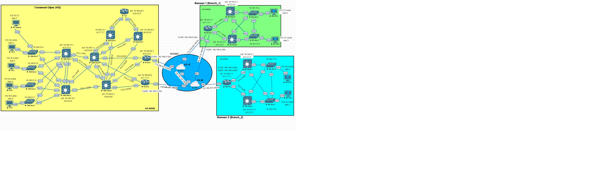

#          Лабораторная работа _"Построение распределенной сети предприятия"_

### Цель работы
  1. спроектировать сеть предприятия состоящую из Головного Офиса (далее HQ) и 2-х филиалов;
  2. построить между между Головным Офисом и филиалами защищенную VPN сеть с использованием протокола ikev2 и аутентификации по сертификатам;
  3. повысить надежность функционирования сети Головной Офис <-> филиал и  филиал <-> филиал за счет использования архитектуры сети Dual Hub Dual Cloud (DHDC).

### Выполнение работы
  В ходе работы была спроектирована сеть предприятия состоящая из Головного Офиса (далее HQ) и 2-х филиалов (далее Branch_1 и Branch_2).

     
#### Для сети HQ был использован следующий принцип:
  1. сеть 10.0.0.0/22 выделено для коммутации сетевого оборудования между собой;
  2. сеть 10.100.0.0/20 в дальнейшем предполагается использовать как сеть управления;
  3. сеть 172.16.0.0/16 клиентские сети.

#### Для сети Branch_1 был использован следующий принцип:
  1. сеть 10.1.1.0/24 выделено для коммутации сетевого оборудования между собой;
  2. сеть 10.101.0.0/20 в дальнейшем предполагается использовать как сеть управления;
  3. сеть 172.17.0.0/16 клиентские сети.

#### Для сети Branch_2 был использован следующий принцип:
  1. сеть 10.2.1.0/24 выделено для коммутации сетевого оборудования между собой;
  2. сеть 10.102.0.0/20 в дальнейшем предполагается использовать как сеть управления;
  3. сеть 172.18.0.0/16 клиентские сети.
      
  При проектировании сети HQ была использована 3-х уровневая иерархическая модель CISCO с использованием следующего сетевого оборудования:
- на Access Layer - L2 коммутаторы;
- на Distribution Layer - L3 коммутаторы;
- на Core Layer - высокопроизводительные маршрутизаторы.

При проектировании сети филиалов была использована 3-х уровневая иерархическая модель с совмещенным Core-Aggregated уровнями с использованием следующего оборудования:
- на Access Layer - L2 коммутаторы;
- на Distribution Layer - L3 коммутаторы.

Для повышения надежности функционирования сети на каждой из площадок на коммутаторах распределения используется протокол HSRP.
В HQ роль активного маршрутизатора между сетями распределена равномерно между 2 коммутаторами L3, что позволяет более равномерно распределить нагрузку.

    SW-Dstr1#sh standby br
                        P indicates configured to preempt.
                        |
    Interface   Grp  Pri P State   Active          Standby         Virtual IP
    Vl2         2    110 P Active  local           172.16.2.2      172.16.2.3
    Vl3         3    110 P Active  local           172.16.3.2      172.16.3.3
    Vl4         4    100   Standby 172.16.4.2      local           172.16.4.3
    Vl5         5    100   Standby 172.16.5.2      local           172.16.5.3
    Vl70        70   110 P Active  local           10.100.21.2     10.100.21.3  

Для организации подключения HQ к филиалам и выхода в интернет установлены 2 граничащих маршрутизатора (R-CE1 и R-CE2), которые имеют подключение к 2
независимым интернет-сервис провайдерам (ISP1 и ISP2). HQ подключается к ISP по протоколу eBGP. Для маршрутизации внутренних сетей используется OSPF 
протокол, где в качестве DR и BDR выбраны маршрутизаторы SW-Core1 и SW-Core. 

Филиалы подключаются к HQ через  ISP с использованием статической маршрутизации и адресов, предоставленных ISP. 
	 
Соединение HQ с филиалами организовано по технологии DMVPN (3 фаза). Маршрутизация между разнесенными офисами выполняется при помощи протокола eBGP.
Для защиты трафика DMVPN используется протокол ikev2 с сертификатами для аутентификации. Для выпуска сертификатов сети развернут 
CA сервер на оборудовании Cisco. Фрагмент кода, используемого на граничащих маршрутизаторах, для аутентификации по сертификатам.

    crypto pki certificate map CERT-MAP 1
    subject-name co ou = dmvpn
    issuer-name co o = otus

    crypto ikev2 profile IKEV2-PROFILE
    match certificate CERT-MAP
    identity local dn
    authentication remote rsa-sig
    authentication local rsa-sig
    pki trustpoint TP-PKI
    dpd 10 5 periodic

В данной работе между HQ и филиалами была использована архитектура сети Dual Hub Dual Cloud (DHDC), часто применяемая при использовании технологии DMVPN. 
В этой конфигурации используются два центральных узла (hub) и две облака (в этом случае spoke), что обеспечивает высокую устойчивость и отказоустойчивость
сети.

    R-CE1#sh ip nhrp br
       Target             Via            NBMA           Mode   Intfc   Claimed
          192.168.0.3/32 192.168.0.3     172.100.200.162 dynamic  Tu100   <   >
          192.168.0.4/32 192.168.0.4     172.160.237.202 dynamic  Tu100   <   >

    B1-CE#sh ip nhrp br
        Target             Via            NBMA           Mode   Intfc   Claimed
           192.168.0.1/32 192.168.0.1     172.248.237.202 static   Tu100   <   >
           192.168.2.1/32 192.168.2.1     172.248.237.198 static   Tu200   <   >

Основные преимущества DHDC:
 - отсутствие единой точки отказа: Если один из центральных узлов выходит из строя, другой узел продолжает обрабатывать трафик.
 - быстрая аварийная замена переключение на резервный узел происходит быстро.

При реализации Dual Hub Dual Cloud были выпонены следующие настройки.

В HQ на роутере SW-Core1 создан tunnel 100, на роутере SW-Core2 tunnel 200. Tunnel 200 был установлен как резервный. Поэтому роутер SW-Core2 во внутренную
сеть он анонсирует дефолтный маршрут с более высокой метрикой.

    default-information originate metric 20

И филиалам SW-Core2 также анонсирует себя с большей метрикой 

    route-map SET-MED permit 10
      set metric 120
    neighbor 192.168.2.4 route-map SET-MED out

На каждом роутере филиала создано по 2 туннельных интерфейса (tunnel 100 и tunnel 200).

Команда **__dpd 10 5 periodic__**, указанная crypto ikev2 profile позволяет определить разрыв в IPSec туннелях и предпринимать действия по восстановлению IPsec 
туннеля.

Работа по технологии DMVPN (3 фаза) при работающем R-CE1

     VPCS> trace 172.17.2.4
     trace to 172.17.2.4, 8 hops max, press Ctrl+C to stop
      1   172.18.2.1   3.907 ms  3.982 ms  5.627 ms
      2   172.18.3.2   1.200 ms  5.776 ms  0.442 ms
      3   10.2.1.5   2.123 ms  2.957 ms  14.611 ms
      4   192.168.0.1   4.992 ms  0.999 ms  6.172 ms
      5   192.168.0.3   5.059 ms  19.844 ms  15.869 ms
      6   10.1.1.6   24.170 ms  44.359 ms  28.917 ms
      7   *172.17.2.4   39.451 ms (ICMP type:3, code:3, Destination port unreachable)

     VPCS> trace 172.17.2.4
     trace to 172.17.2.4, 8 hops max, press Ctrl+C to stop
      1   172.18.2.1   0.858 ms  0.785 ms  0.283 ms
      2   172.18.3.2   0.465 ms  0.405 ms  1.294 ms
      3   10.2.1.5   3.372 ms  0.540 ms  1.736 ms
      4   192.168.0.3   2.424 ms  2.193 ms  2.853 ms
      5   10.1.1.6   1.934 ms  2.785 ms  10.583 ms
      6   *172.17.2.4   2.974 ms (ICMP type:3, code:3, Destination port unreachable)

Работа по технологии DMVPN (3 фаза) когда R-CE1 недоступен

     VPCS> trace 172.17.2.4
     trace to 172.17.2.4, 8 hops max, press Ctrl+C to stop
      1   172.18.2.1   0.496 ms  4.022 ms  4.833 ms
      2   172.18.3.2   0.414 ms  3.583 ms  0.347 ms
      3   10.2.1.5   6.609 ms  1.468 ms  12.520 ms
      4   192.168.2.1   15.962 ms  1.795 ms  3.980 ms
      5   192.168.2.3   14.577 ms  3.923 ms  5.655 ms
      6   10.1.1.6   27.136 ms  41.751 ms  19.542 ms
      7   *172.17.2.4   32.345 ms (ICMP type:3, code:3, Destination port unreachable)

     VPCS> trace 172.17.2.4
     trace to 172.17.2.4, 8 hops max, press Ctrl+C to stop
      1   172.18.2.1   9.667 ms  1.842 ms  5.021 ms
      2   172.18.3.2   2.267 ms  0.991 ms  0.294 ms
      3   10.2.1.5   1.810 ms  0.289 ms  0.623 ms
      4   192.168.2.3   0.734 ms  0.602 ms  6.809 ms
      5   10.1.1.6   1.374 ms  1.016 ms  4.634 ms
      6   *172.17.2.4   3.323 ms (ICMP type:3, code:3, Destination port unreachable)

Разделение трафика на интернет (на IPS1 обьявлен lo1 8.8.8.8) и VPN

Вывод команды show crypto ipsec sa

    R-CE1#sh cryp ipsec sa

    interface: Tunnel100
        Crypto map tag: Tunnel100-head-0, local addr 172.248.237.202

       protected vrf: (none)
       local  ident (addr/mask/prot/port): (172.248.237.202/255.255.255.255/47/0)
       remote ident (addr/mask/prot/port): (172.100.200.162/255.255.255.255/47/0)
       current_peer 172.100.200.162 port 500
         PERMIT, flags={origin_is_acl,}
         #pkts encaps: 381, #pkts encrypt: 381, #pkts digest: 381
         #pkts decaps: 383, #pkts decrypt: 383, #pkts verify: 383
         #pkts compressed: 0, #pkts decompressed: 0
         #pkts not compressed: 0, #pkts compr. failed: 0
         #pkts not decompressed: 0, #pkts decompress failed: 0
         #send errors 0, #recv errors 0

          local crypto endpt.: 172.248.237.202, remote crypto endpt.: 172.100.200.162
          plaintext mtu 1438, path mtu 1500, ip mtu 1500, ip mtu idb (none)
          current outbound spi: 0xBDF42FBF(3186896831)
          PFS (Y/N): N, DH group: none

          inbound esp sas:
           spi: 0xB3D8914F(3017314639)
             transform: esp-aes esp-sha-hmac ,
             in use settings ={Tunnel, }
             conn id: 13, flow_id: SW:13, sibling_flags 80000040, crypto map: Tunnel100-head-0
             sa timing: remaining key lifetime (k/sec): (4200963/2673)
             IV size: 16 bytes
             replay detection support: Y
             Status: ACTIVE(ACTIVE)

       --More--
 

### Выводы и планы по развитию
#### Вывод:
   Реализация данной схемы позволило повысить, как доступность Головного Офиса, так и взаимную доступность филиалов.
#### План по развитию:   
   1. Реализовать данную схему, в которой подключение всех офисов к сервис-провайдерам выполнено по eBGP.
   2. Настроить защиту клиентских портов на коммутаторах-доступа.

Файлы конфигурации сетевых устройств:  
  [SW-Acc1](https://github.com/kononenko-yury/otus-network-practics/blob/main/lab45/SW-Acc1);
  [SW-Acc2](https://github.com/kononenko-yury/otus-network-practics/blob/main/lab45/SW-Acc2);
  [SW-Acc3](https://github.com/kononenko-yury/otus-network-practics/blob/main/lab45/SW-Acc3);
  [SW-Acc4](https://github.com/kononenko-yury/otus-network-practics/blob/main/lab45/SW-Acc4);
  [SW-Dstr1](https://github.com/kononenko-yury/otus-network-practics/blob/main/lab45/SW-Dstr1);
  [SW-Dstr2](https://github.com/kononenko-yury/otus-network-practics/blob/main/lab45/SW-Dstr2);
  [SW-Core1](https://github.com/kononenko-yury/otus-network-practics/blob/main/lab45/SW-Core1);
  [SW-Core2](https://github.com/kononenko-yury/otus-network-practics/blob/main/lab45/SW-Core2);
  [DstrSrv1](https://github.com/kononenko-yury/otus-network-practics/blob/main/lab45/DstrSrv1);
  [DstrSrv2](https://github.com/kononenko-yury/otus-network-practics/blob/main/lab45/DstrSrv2);
  [CA](https://github.com/kononenko-yury/otus-network-practics/blob/main/lab45/CA);
  [R-CE1](https://github.com/kononenko-yury/otus-network-practics/blob/main/lab45/R-CE1);
  [R-CE2](https://github.com/kononenko-yury/otus-network-practics/blob/main/lab45/R-CE2);
  [ISP1](https://github.com/kononenko-yury/otus-network-practics/blob/main/lab45/ISP1);
  [ISP2](https://github.com/kononenko-yury/otus-network-practics/blob/main/lab45/ISP2);
  [B1-CE](https://github.com/kononenko-yury/otus-network-practics/blob/main/lab45/B1-CE);
  [B1-Dstr1](https://github.com/kononenko-yury/otus-network-practics/blob/main/lab45/B1-Dstr1);
  [B1-Dstr2](https://github.com/kononenko-yury/otus-network-practics/blob/main/lab45/B1-Dstr2);
  [B1-Acc1](https://github.com/kononenko-yury/otus-network-practics/blob/main/lab45/B1-Acc1);
  [B1-Acc2](https://github.com/kononenko-yury/otus-network-practics/blob/main/lab45/B1-Acc2);
  [B2-CE](https://github.com/kononenko-yury/otus-network-practics/blob/main/lab45/B2-CE);
  [B2-Dstr1](https://github.com/kononenko-yury/otus-network-practics/blob/main/lab45/B2-Dstr1);
  [B2-Dstr2](https://github.com/kononenko-yury/otus-network-practics/blob/main/lab45/B2-Dstr2);
  [B2-Acc1](https://github.com/kononenko-yury/otus-network-practics/blob/main/lab45/B2-Acc1);
  [B2-Acc2](https://github.com/kononenko-yury/otus-network-practics/blob/main/lab45/B2-Acc2).  
 
